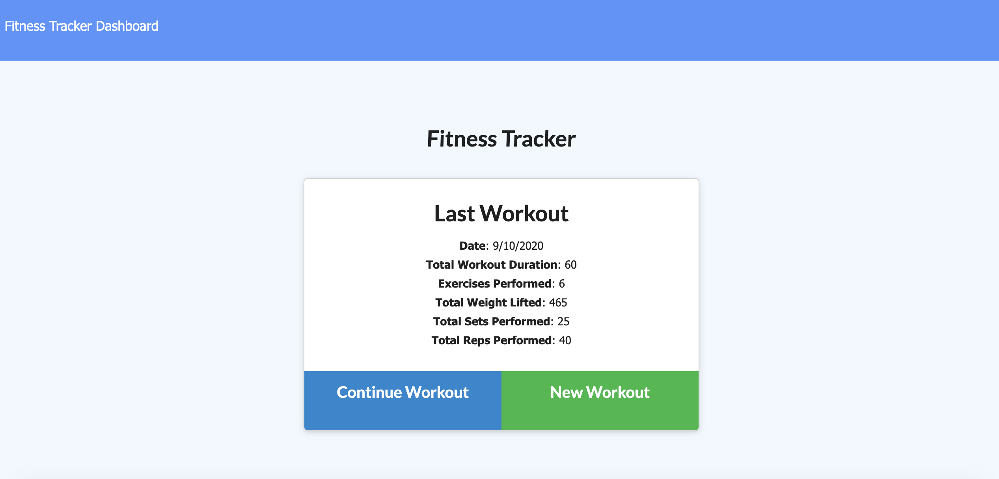
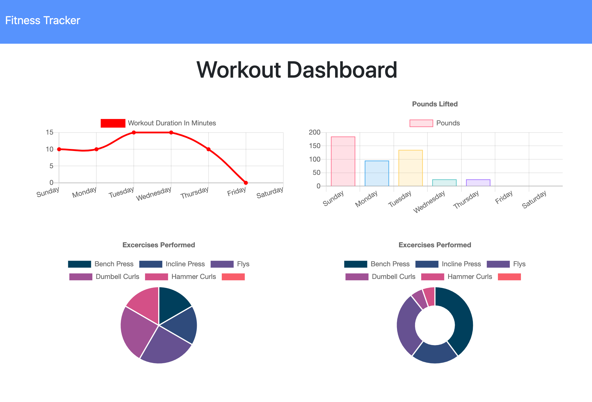

# workout-tracker

This application is deployed at : https://thawing-bayou-03032.herokuapp.com/

### Description:
>This application allows a user to log their workouts everyday.  They can create new workouts and add which exercises they include in that workout.  They can pick up a workout where they left off, and lastly they can view their stats from all of the previous workouts organized by some graphs and pie charts.

## Technologies Used:
This full stack application uses, node.js and express to create the server.  We are using mongoDB and mongoose for our database.  The application is deployed with heroku.

## Usage:
To create a workout, simply click "New Workout".  Select the type of exercise, and then fill in the proper fields to define the exercise you did.  Add as many exercises as you want and click complete when you finish.  Any time you come back to the application it shows the previous workout you were doing, and you can either continue that workout or make a new one.  To view the stats just click the "dashboard" button in the nav bar and it will display all the stats from your previous workouts.

